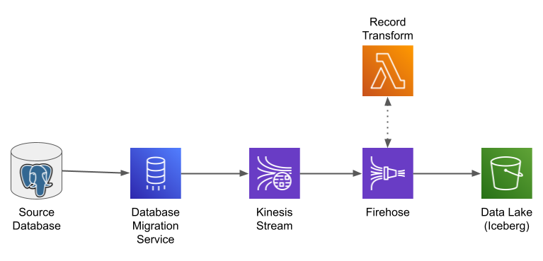

CloudFormation templates to set up a data pipeline from a Postgres database server to Iceberg
tables in a data lake, using Amazon Database Migration Service and AWS Data Firehose. Used as a
data source for [this blog post]( https://chariotsolutions.com/blog/post/dms_firehose_iceberg/).

Prerequisites:

  * Install and configure the `pglogical` extension in your Postgres database server
    (see [this AWS doc](https://docs.aws.amazon.com/dms/latest/userguide/CHAP_Source.PostgreSQL.html) or the blog post
    linked above for more information.
  * Create a Secrets Manager secret to hold connection information, if you don't already have one.
  * Create a Kinesis Data stream to receive captured records. For best performance, configure with four (4) shards.
  * Create an S3 bucket to serve as your data lake.

There are three templates, which should be applied in the order shown:

  * [dms.yml](dms.yml): creates the DMS replication instance, endpoints, and replication task. _Do not_ start the
    task until all stacks have been created.
  * [glue.yml](glue.yml): creates a dedicated Glue database and tables to hold TPC-C data.
  * [firehose.yml](firehose.yml): creates a Firehose (with transformation Lambda) that extracts records from the
    Kinesis stream and writes them to the appropriate Iceberg table.

You'll see that there are several parameters that are shared between stacks, such as the ARN of the Kinesis stream.

Once you have everything in place, you can run the [BenchBase](https://github.com/cmu-db/benchbase) TPC-C benchmark.

This will require a Java development environment with Maven; if you do not have such an environment, I recommend
spinning up an `md5.large` EC2 instance and installing the necessary packages.

To run the benchmark you'll need to change the configuration file to include your database credentials. I also
increased the scale factor to 2, and the number of terminals to 10.
