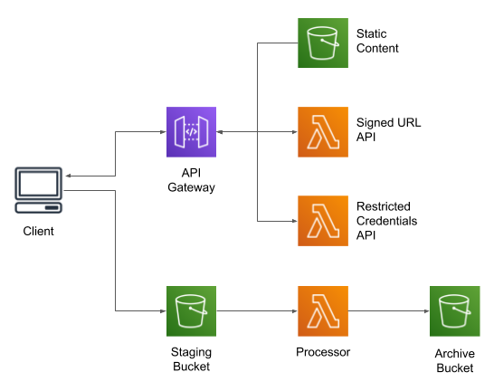
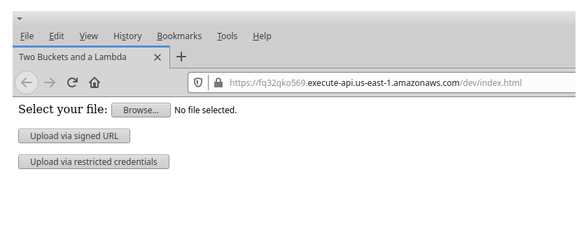

# Two Buckets and a Lambda: a pattern for S3 file transformation

**Currently being updated**

This is the example code for [this blog post](https://chariotsolutions.com/blog/post/two-buckets-and-a-lambda-a-pattern-for-file-processing/).
It implements a simple web-app to provide users the ability to upload files, in addition to the actual processor Lambda.




## Deployment

This example supports deployment with either CloudFormation or Terraform. Each is in
its own directory, and the instructions below assume that you're running the relevant
scripts from inside the directory.

In either case, it creates the following resources (along with related resources such
as IAM roles):

* Three buckets: one to hold new uploads, one to hold processed files, and one to
  hold static content for the web-app.

* Three Lambdas: one to perform processing on uploaded files, and two that act as
  API endpoints to provide credentials or a signed URL.

* An HTTP Gateway (API Gateway v2) that provides a simple web-app to allow users
  to upload files.


### CloudFormation

In order to keep the deployment self-contained and single-step, the CloudFormation
deployment uses a shell script to upload static content and deploy the Lambda code.

From within the `cloudformation` directory:

```
./deploy.sh STACK_NAME BASE_BUCKET_NAME
```

* `STACK_NAME` is the name for your stack; it must be unique within the account/region.

* `BASE_BUCKET_NAME` is used to name the three buckets; the suffixes `-uploads`, `-archive`,
  and `-static` will be applied to it. Bucket names must be globally unique; I recommend a
  reverse domain name that includes the stack name: `com-example-mystack` (note that bucket
  names must be lowercase).

All resources created by the stack are named after the stack (except the buckets, due to
the requirement for DNS-compatible naming).

The stack should take less than five minutes to create. However, the script uses the CLI
"wait" command, which doesn't time out until an hour has elapsed. You can either get the
status of the stack via the CLI in another window, or watch the creation events in the
console.

When it's done, it will write the HTTPS endpoint of the example web-app. You can then
open that link in your browser.

To tear down the stack run the "undeploy" script, which force-deletes the S3 buckets and
uses CloudFormation to delete the other resources:

```
./undeploy.sh STACK_NAME BASE_BUCKET_NAME
```


### Terraform

Start by installing required modules. From within the `terraform` directory:

```
terraform init
```

Then, to deploy the application, replacing variables as appropriate:

```
terraform apply --var=base_bucket_name=BASE_BUCKET_NAME
```

To destroy the resources:

```
terraform destroy --var=base_bucket_name=BASE_BUCKET_NAME
```

Notes:

* The buckets have `force_destroy` set to `true` so that they can be torn down without
  manual intervention. For a real-world deployment, you would _not_ do this.

* The Terraform config also uploads static content for the web-app. For this example,
  that's only three files; it might not be practical for a real-world deployment.

* The Lambdas are created with a custom module that is part of the source tree. This
  module is tailored to the specific use-case of a single-file Lambda handler that's
  external to the Terraform source subtree.


## Use

If you go to the link, you'll see the rather uninspiring UI shown below. I recommend also
opening your browser's Developer Tools, so that you can see the console and network traffic.



Click "Browse" to select a file, then either "Upload via signed URL" or "Upload via
restricted credentials" to upload that file to the staging bucket.

If you look at the staging bucket in the AWS console, you probably won't find your file
there: the Processing Lambda runs quickly. Instead, the file will be in the archive bucket,
and there will be a message in the log for the Processing Lambda.

Feel free to extract the temporary credentials from the API response and try to use them
to upload another file.


## Implementation Notes

### Example Web-App

In addition to the "processing" Lambda, this project also demonstrates two ways to upload
a file from the browser to S3:

* A signed URL, which allows anyone with the URL to upload a file using built-in browser
  functionality. The URL is limited to a single named file (S3 key), with a specified
  content type, uploaded via HTTP PUT. I do not set an expiration time, but the URL is
  effectively limited by the expiration of the Lambda's credentials.

* Limited-scope credentals, which lets the browser use the AWS JavaScript SDK to perform
  the upload. These credentials are again limited to a single file, but give the caller
  the flexibility to set content-type and other metadata, and to use a multi-part upload.

The client-side JavaScript doesn't try to be too clever: it breaks out the various steps
as separate functions, and does not rely on chained promises. It also creates the two
operational functions in global scope, and explicitly attaches them to the buttons in HTML.
I'll be honest, I use JavaScript under duress.

There is one bit of the JavaScript that requires some extra explanation

```
const rootUrl = window.location.href.replace(/[^/]*$/, "");
const queryUrl = rootUrl + "api/signedurl";
```

This code is an artifact of the original (API Gateway V1) implementation, which appends
a "stage" name to all URLs. API Gateway v2 supports a "default" stage that uses the root
URL without suffix. However, to maximize portability, I've decided to leave this
suffix-trimming code in place.


### JavaScript SDK v2 versus v3

This example uses the version 2 JavaScript SDK, retrieved from Amazon's distribution
site. This is a large download (over 2 MB), as it supports for all AWS services.

The version 3 SDK is modular, but [requires a build step](https://docs.aws.amazon.com/sdk-for-javascript/v3/developer-guide/welcome.html#welcome_web)
that packages the client code for services that you use. While this makes sense for a
production application, it would make this example needlessly complex.


### Credential Timeouts

Both the presigned URL and the limited-scope credentials are only valid for a limited
time. In the case of a presigned URL, that timeout depends on the expiration of the
credentials used to sign the URL. The Signed URL Lambda execution role has a default
session limit of one hour, so that's your effective limit (although when I looked at 
CloudTrail, it seemed to indicate that the session was valid for 12 hours!).

In the case of the limited-scope credentials, the story is more complex: the Lambda
assumes a role in order to get the scoped credentials, which means that it's subject to
[role chaining](https://docs.aws.amazon.com/IAM/latest/UserGuide/id_roles_terms-and-concepts.html#iam-term-role-chaining),
which limits the maximum session duration of the assumed role to one hour. While this
is fine for basic PUT operations, it might cause a large multi-part upload to fail
(depending on the size of the file and your upload bandwidth).

Since role chaining only applies when you use one role to assume another, you can 
get the full duration of the assumed role by using long-lived credentials (ie, those
associated with an IAM user), 

If this is something that you need to do, I recommend creating an "upload" user, whose
permissions are restricted to assuming the "credentials assumed role" (created by the
deployment script). Create access keys for this user, and store them in Secrets Manager.
Then change the Credentials Lambda to create an STS client using those keys, rather than
the default.
