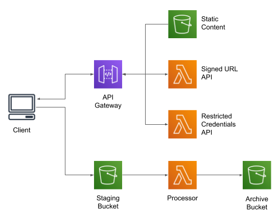
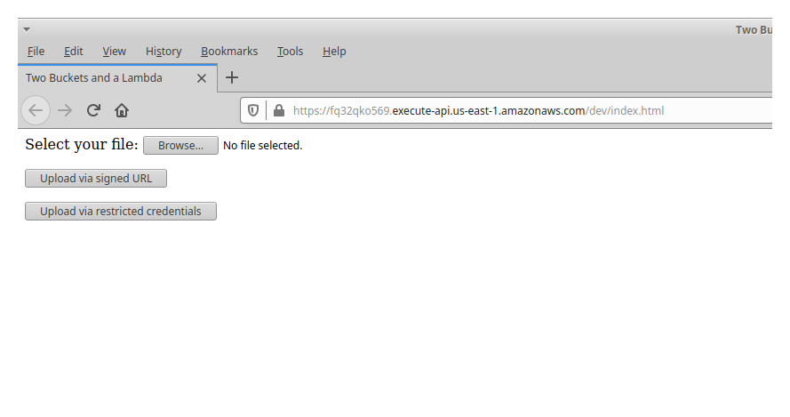

# Two Buckets and a Lambda: a pattern for S3 file transformation

**Currently being updated**

This is the example code for [this blog post](https://chariotsolutions.com/blog/post/two-buckets-and-a-lambda-a-pattern-for-file-processing/).
It implements a simple web-app to provide users the ability to upload files, in addition to the actual processor Lambda.




## Deployment

This example supports deployment with either CloudFormation or Terraform. Each is in
its own directory, and the instructions below assume that you're running the relevant
scripts from inside the directory.

In either case, it creates the following resources (along with related resources such
as IAM roles):

* Three buckets: one to hold new uploads, one to hold processed files, and one to
  hold static content for the web-app.

* Three Lambdas: one to perform processing on uploaded files, and two that act as
  API endpoints to provide credentials or a signed URL.

* An HTTP Gateway (API Gateway v2) that provides a simple web-app to allow users
  to upload files.


### CloudFormation

In order to keep the deployment self-contained and single-step, the CloudFormation
deployment uses a shell script to upload static content and deploy the Lambda code.

From within the `cloudformation` directory:

```
./deploy.sh STACK_NAME BASE_BUCKET_NAME
```

* `STACK_NAME` is the name for your stack; it must be unique within the account/region.

* `BASE_BUCKET_NAME` is used to name the three buckets; the suffixes `-uploads`, `-archive`,
  and `-static` will be applied to it. Bucket names must be globally unique; I recommend a
  reverse domain name that includes the stack name: `com-example-mystack` (note that bucket
  names must be lowercase).

All resources created by the stack are named after the stack (except the buckets, due to
the requirement for DNS-compatible naming).

The stack should take less than five minutes to create. However, the script uses the CLI
"wait" command, which doesn't time out until an hour has elapsed. You can either get the
status of the stack via the CLI in another window, or watch the creation events in the
console.

When it's done, it will write the HTTPS endpoint of the example web-app. You can then
open that link in your browser.

To tear down the stack run the "undeploy" script, which force-deletes the S3 buckets and
uses CloudFormation to delete the other resources:

```
./undeploy.sh STACK_NAME BASE_BUCKET_NAME
```


### Terraform


## Use

If you go to the link, you'll see the rather uninspiring UI shown below. I recommend also
opening your browser's Developer Tools, so that you can see the console and network traffic.



Click "Browse" to select a file, then either "Upload via signed URL" or "Upload via
restricted credentials" to upload that file to the staging bucket.

If you look at the staging bucket in the AWS console, you probably won't find your file
there: it will be in the archive bucket, and there will be a message in CloudWatch logs.

Feel free to extract the temporary credentials from the API response and try to use them
to upload another file.


## Implementation Notes

### Example Web-App

In addition to demonstrating the "two buckets" processing Lambda, this example also provides
examples of uploading the files to S3. It is implemented as a simple web-app, using API
Gateway to serve both static content and two Lambda-backed endpoints (`/api/credentials`
and `/api/signedurl`). To simplify the example, I use "proxy" integations for all three.

The client-side JavaScript code is intended as a tutorial, so breaks out the various steps
as separate functions and does not rely on chained promises. It also creates the two
operational functions in global scope, and explicitly attaches them to the buttons in HTML.
Scroll to the end of the file to see this function.

There is one bit of the JavaScript that requires some extra explanation

```
const rootUrl = window.location.href.replace(/[^/]*$/, "");
const queryUrl = rootUrl + "api/signedurl";
```

One of the quirks of API Gateway is that it deploys "stages": you can have a development
stage and a production stage of the same API (or, more realistically, a `v1` and `v2`
stage). When you do this, the stage name is part of the URL:
`https://fq14qko999.execute-api.us-east-1.amazonaws.com/dev/api/credentials`. In a
typical web-app, you would refer to an endpoint within JavaScript or HTML without
the hostname: `/api/credentials`. However, this will fail when running with API Gateway,
_except in the case where you're using a custom domain name to access the endpoint._

When the JavaScript file is loaded, `window.location.href` contains the URL of the web
page: `https://fq14qko999.execute-api.us-east-1.amazonaws.com/dev/index.html` in this
case. So the regex strips off the `index.html` part, and `queryUrl` adds the hardcoded
path to the relevant Lambda endpoint.

### Role chaining
